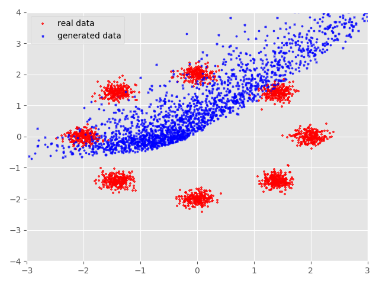
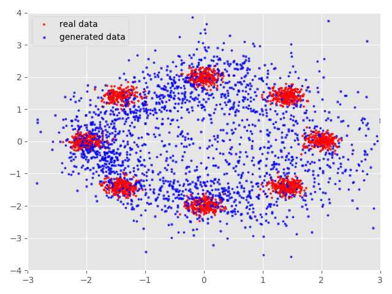
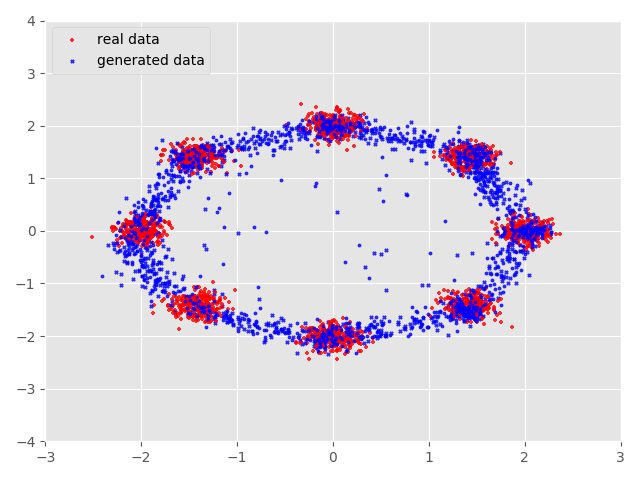
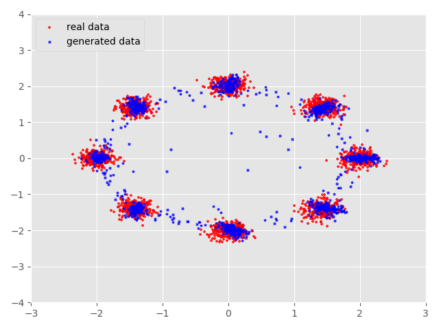
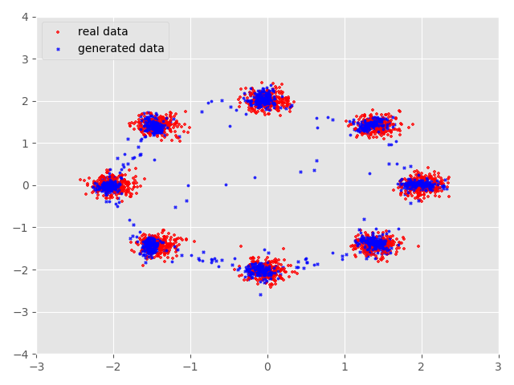
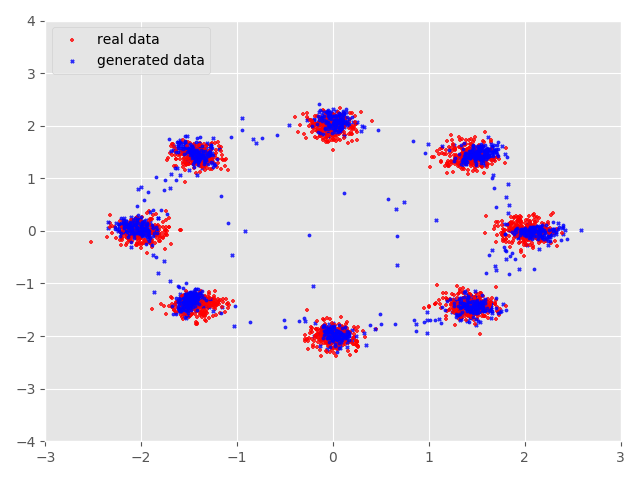
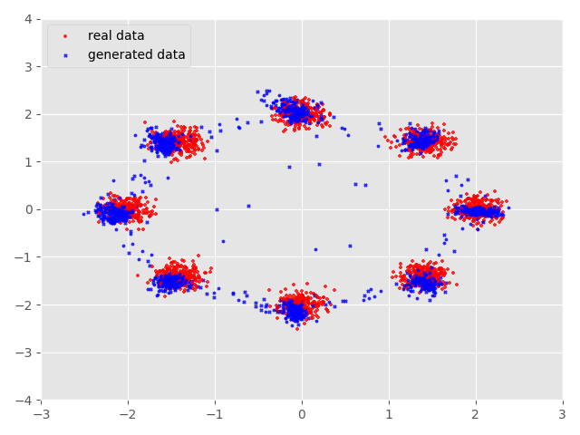
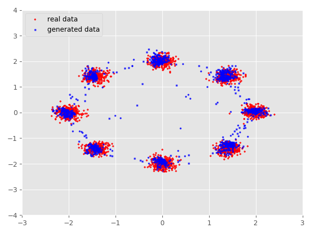
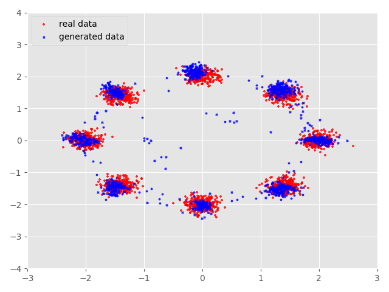

Visualize GAN
======================================================

The code is tested on Linux operating system with Python 2.7 or 3.x, TensorFlow 1.4.0.

Run the model using this command:
-------------------------------------
	python main.py --gan_type GAN

Please kindly look at the file `main.py` for hyperparameter arguments.

#### Visualize GAN
*Name* | *Epoch 1000* | *Epoch 2000* | *Epoch 3000*
:---: | :---: | :---: | :---: |
GAN |  |  | 
  | *Epoch 10000* | *Epoch 13000* | *Epoch 16000*
GAN |  |  |  
  | *Epoch 25000* | *Epoch 35000* | *Epoch 45000*
GAN |  |  | 

author: 武广

email: twistedwg@hotmail.com

