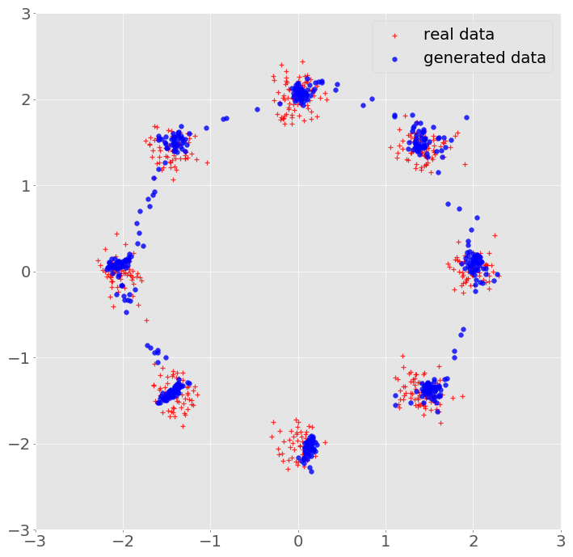

Visualize GAN
======================================================

The code is tested on Linux operating system with Python 2.7 or 3.x, TensorFlow 1.4.0.

Run the model using this command:
-------------------------------------
	python main.py --gan_type GAN

Please kindly look at the file `main.py` for hyperparameter arguments.

GAN epoch 25000

author: 武广
email: twistedwg@hotmail.com

